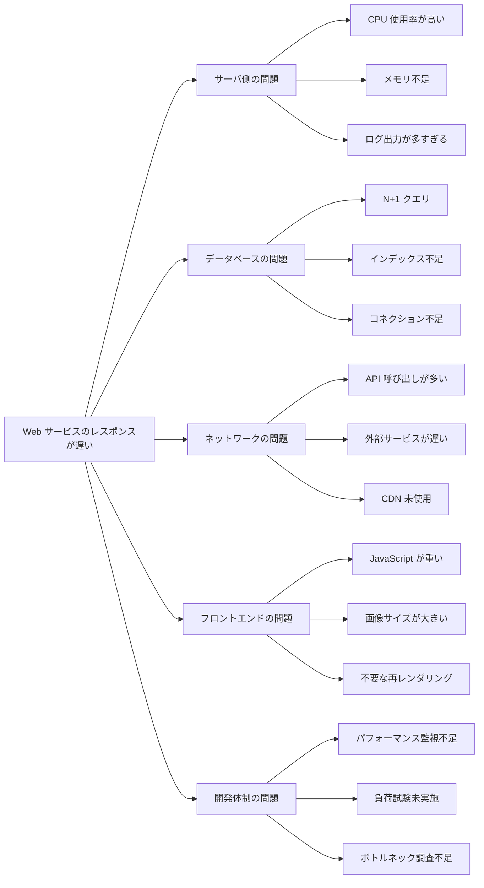

# mdls2mmd

Markdown リストから Mermaid フローチャート**のコード**を生成する CLI ツール. 

## ビルド

```bash
cargo build --release
```

または

```bash
nix build
```

## 使い方

```bash
# ファイルを変換
mdls2mmd input.md

# 方向を指定 (LR / TD / RL / BT)
mdls2mmd -d TD input.md

# ファイルへ出力
mdls2mmd input.md -o diagram.mmd

# stdin からパイプ
cat list.md | mdls2mmd
```

NixOS であれば

```bash
nix run github:espeon011/mdls2mmd -- input.md
```

のようにインストールなしで実行可能. 

## 例

入力:

```markdown
- Web サービスのレスポンスが遅い
  - サーバ側の問題
    - CPU 使用率が高い
    - メモリ不足
    - ログ出力が多すぎる
  - データベースの問題
    - N+1 クエリ
    - インデックス不足
    - コネクション不足
  - ネットワークの問題
    - API 呼び出しが多い
    - 外部サービスが遅い
    - CDN 未使用
  - フロントエンドの問題
    - JavaScript が重い
    - 画像サイズが大きい
    - 不要な再レンダリング
  - 開発体制の問題
    - パフォーマンス監視不足
    - 負荷試験未実施
    - ボトルネック調査不足
```

出力

```
flowchart LR
    N1["Web サービスのレスポンスが遅い"]
    N1_1["サーバ側の問題"]
    N1_1_1["CPU 使用率が高い"]
    N1_1_2["メモリ不足"]
    N1_1_3["ログ出力が多すぎる"]
    N1_2["データベースの問題"]
    N1_2_1["N+1 クエリ"]
    N1_2_2["インデックス不足"]
    N1_2_3["コネクション不足"]
    N1_3["ネットワークの問題"]
    N1_3_1["API 呼び出しが多い"]
    N1_3_2["外部サービスが遅い"]
    N1_3_3["CDN 未使用"]
    N1_4["フロントエンドの問題"]
    N1_4_1["JavaScript が重い"]
    N1_4_2["画像サイズが大きい"]
    N1_4_3["不要な再レンダリング"]
    N1_5["開発体制の問題"]
    N1_5_1["パフォーマンス監視不足"]
    N1_5_2["負荷試験未実施"]
    N1_5_3["ボトルネック調査不足"]

    N1 --> N1_1
    N1_1 --> N1_1_1
    N1_1 --> N1_1_2
    N1_1 --> N1_1_3
    N1 --> N1_2
    N1_2 --> N1_2_1
    N1_2 --> N1_2_2
    N1_2 --> N1_2_3
    N1 --> N1_3
    N1_3 --> N1_3_1
    N1_3 --> N1_3_2
    N1_3 --> N1_3_3
    N1 --> N1_4
    N1_4 --> N1_4_1
    N1_4 --> N1_4_2
    N1_4 --> N1_4_3
    N1 --> N1_5
    N1_5 --> N1_5_1
    N1_5 --> N1_5_2
    N1_5 --> N1_5_3
```

このコードを mermaid-cli で画像に変換するか, GitHub 等の mermaid をレンダリングできるサービスで Markdown ファイルに張り付けることで可視化できる. 
GitHub に張り付ける場合は

````
```mermaid
ここに張り付ける
```
````

すると次のように描画される. 


